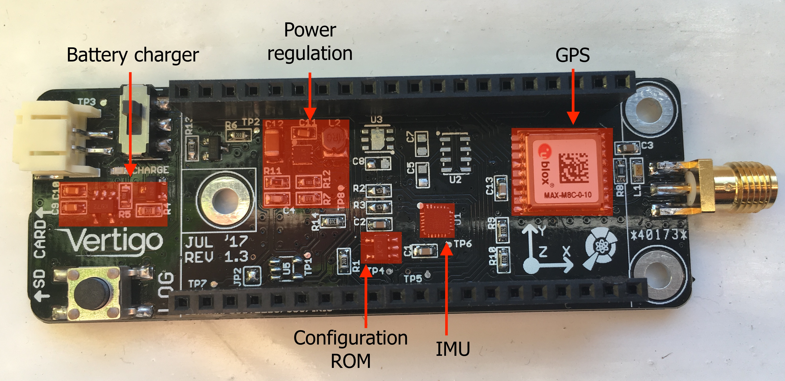

# VertigoIMU Hardware Information

_A compact 11dof inertial datalogger with AHRS_

[Home](index.md)

On this page:
* [Components on VertigoIMU](#diag)
* [Test Points](#tp)
* [Battery Charging](#charge)
* [Reverse Polarity Protection](#rp)
* [Power Supplies](#psu)
* [Hardware Changelog](#hwchangelog)

## Components

## Test Points

Test points are provided on Vertigo for hardware integrity testing and QC. They
are labelled TPx on the silkscreen and are described below.

1. 5V output from boost converter
2. Enable signal for the TPS boost reg
3. Battery voltage
4. SCL for IMU
5. SDA for IMU
6. Interrupt line for IMU
7. 5V switched into MBED Vin
8. "Power good" output from boost converter

## Battery Charging

Current: R4 sets the LiPo charge current, see the MCP73831 datasheet for more
information. Use 10kR for 100mA or 2kR for 500mA.

An LED near the battery connector, labelled `CHARGE`, is lit when charging is
ongoing and is extinguished at charge termination.

## Reverse polarity protection

Vertigo is fully reverse polarity protected. Q1 is a P-channel MOSFET which is
arranged to provide this protection.

## Power Supplies

Vertigo is powered by a single (1S) 3.7V LiPo cell. The MBED LPC1768 must be
supplied with a voltage on its VIN pin at a minimum of 4.5V. A TPS61252 boost
converter is employed to create this 4.5V (so that the loss in the LDOs is
minimised) supply that is required by the MBED. The MBED LDOs provide 3.3V on
the VOUT pin to power the peripherals on Vertigo. The boost converter operates
at around 90% efficiency from a 3.7V source. 

The enable (`EN`) pin on the TPS is typically weakly tied (10kR) to `VBATT`,
which keeps the regulator enabled. An N-channel MOSFET is connected between
`EN` and `GND`, with its gate tied to `VUSB`. This means that when the MBED is
plugged into USB, the TPS regulator is disabled and Vertigo is powered solely
through the USB connection to allow the battery to be charged.

## Hardware Changelog

* 1.0: 
    * Initial version.
    * MPU-9150 footprint used instead of MPU-9250
    * Immediately retired.
* 1.1:
    * Dropped helical onboard GPS antenna in favour of SMA with circuitry for active antenna.
    * Added reverse polarity protection.
* 1.2: 
    * Dropped bluetooth.
    * Added user push-button.
    * Dropped extra mini-USB (always use MBED one).
    * Added CHARGE LED for LiPo charger & disconnected CHARGE_STAT from MBED.
    * Removed duplicated PROG resistor (R4/R5).
* 1.3:
    * Baro pressure moved to separate SPI periph.
    * Fixed Vusb detect for disabling boost reg.
    * Added Test Points.
    * Added RESET line for GPS.
    * Added SHDN line for MPL115.
    * Added EEPROM (I2C).
    * Switched to TPS61251 boost conv.
