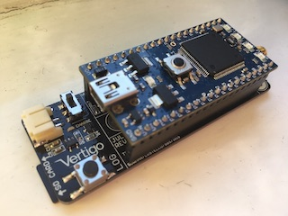

# VertigoIMU

_A compact 11dof inertial datalogger with AHRS_

## Welcome

If you're new to VertigoIMU you'll want to read these two pages:

1. [Usage Instructions](usage.md) - How to assemble, collect data with, and troubleshoot the VertigoIMU datalogger
2. [Log Data Information](logdata.md) - How to interpret and analyse the log files produced by VertigoIMU

## Further Information

For those interested in more information about VertigoIMU:

* [Hardware Information](hardware.md) - further hardware information
* [Serial Numbers](serial.md) - a list of serial numbers of past and present VertigoIMU units, as well as a hardware changelog.

## About VertigoIMU

VertigoIMU is was designed by [Jon Sowman](http://www.jonsowman.com) and [Sutton
Grammar School](http://www.suttongrammar.sutton.sch.uk) wit support from [The
ERA Foundation](https://www.erafoundation.org) and the [Institute for Research
in Schools](http://researchinschools.org).

  
